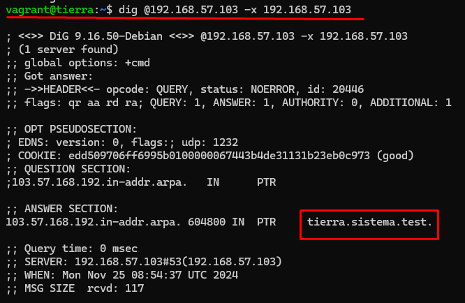
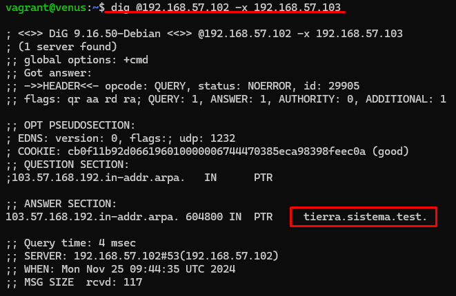

# sistema.master.slave
<hr style="color: white; border-radius: 5px;">
Dentro del directorio `.vagrant` crearemos un `Vagrantfile` en que el crearemos tres MV:
-   Máquina maestro: `tierra.sistema.test` (Debian texto, IP: `192.168.57.103`).
-   Máquina esclavo: `venus.sistema.test` (Debian texto, IP: `192.168.57.102`).
-   Dominio de correo: `marte.sistema.test` (Windows server)

No se deberá tener bajo control de versiones el directorio `.vagrant` ni los **ficheros de backup**.

Después ejecutaremos el comando `vagrant up` para crear, configurar e iniciar las MV. Tras esto mismo ejecutaremos el comando `vagrant ssh <nombre mv>`, que en este caso nos conectaremos a la máquina maestra `tierra`.

Ahora lo que haremos será activar solamente la **escucha del servidor para el protocolo IPv4**. Para ello nos conectaremos a la MV e instalaremos e instalaremos *Bind9*, que es un softaware de servidor DNS utilizado para resolver nombre de dominio y de entra todas sus funciones, hay una que nos permitirá hacer lo que nosotros queremos.

Antes de instalar cualquier programa en Linux, siempre es recomendable actualizar los paquetes mediante `sudo apt-get update`.

Para ello primero tendrémos que instalarlo mediante el comando `sudo apt-get install bind9 bind9utils bind9-doc` dentro la MV. Ahora modificaremos el archivo general de configuración `sudo nano /etc/default/named` y pondremos el valor `OPTIONS` que solo use IPv4 de esta forma:
`OPTIONS = "-u bind -4"`.
</br>
Y guardaremos los cambios.

Ahora modificaremos el archivo `named.conf.options` utilizando el comando `sudo nano /etc/bind/named.conf.options` y pondremos `dnssec-validation <valor>;` en *yes* para activar la validación de DNS en .

Ahora permitiremos que los servidores permitan consultas recursivas sólo a los ordenadores en la red `127.0.0.0/8` y en la red `192.168.57.0/24`, para ello utilzaremos la opción de control de acceso o `acl` añadiendo las siguientes líneas de código al archivo de configuración:
```
acl "redes_permitidas" {
    127.0.0.0/8;        // Loopback (localhost)
    192.168.57.0/24;    // Red local específica
};
```

El archivo nos quedaría tal que así:
```
acl "internal" {
    127.0.0.0/8;       # Permitir consultas desde localhost
    192.168.57.0/24;   # Permitir consultas desde la red interna
};

options {
    directory "/var/cache/bind";

    // Escuchar solo en la red IPv4
    listen-on { 192.168.57.103; };  # IP del maestro (tierra)
    listen-on-v6 { none; };         # Desactivar IPv6 completamente

    // Permitir consultas recursivas solo desde las redes definidas en la acl
    allow-query { "internal"; };
    recursion yes;

    // Validación DNSSEC activada
    dnssec-validation yes;

    // NXDOMAIN no autoritativo
    auth-nxdomain no;

    // Otras opciones predeterminadas
    forwarders { 208.67.222.222; };   # OpenDNS
    forward only;   # Reenvía solo a los servidores especificados
};
```

Ahora reiniciaremos el servidor y después comprobaremos su estado:
`sudo systemctl restart named`
`sudo systemctl status named`

Si todo ha salido bien nos tendrá que devolver algo así:


Ahora lo que haremos será poner la MV de `tierra` como maestro con el nombre `tierra.sistema.test` y tendrá autoridad sobre la zona directa e inversa. Para ello uilizaremos el siguiente comando abriendo el archivo de configuración local de Bind9 con el comando `sudo nano /etc/bind/named.conf.local` y lo dejaremos de la siguiente forma: 
```
// Zona directa
zone "sistema.test" {
    type master;                        // Es el servidor maestro
    file "/etc/bind/db.sistema.test";   // Archivo de configuración de la zona directa
};

// Zona inversa
zone "57.168.192.in-addr.arpa" {
    type master;                        // Es el servidor maestro
    file "/etc/bind/db.192.168.57";     // Archivo de configuración de la zona inversa
};
```

Ahora lo que haremos será crear el archivo de zona directa con los comandos:
`sudo cp /etc/bind/db.local /etc/bind/db.sistema.test`
`sudo nano /etc/bind/db.sistema.test`

Y dentro de este pondremos el siguiente bloque de código:
```
$TTL    604800
@       IN      SOA     tierra.sistema.test. root.sistema.test. (
                              3         ; Serial
                         604800         ; Refresh
                          86400         ; Retry
                        2419200         ; Expire
                         604800 )       ; Negative Cache TTL

; Servidores de nombres
@       IN      NS      tierra.sistema.test.

; Registros A para los hosts
tierra  IN      A       192.168.57.103
venus   IN      A       192.168.57.102
marte   IN      A       192.168.57.104

; Alias para los servidores
ns1     IN  CNAME   tierra.sistema.test.
ns2     IN  CNAME   venus.sistema.test.

; Alias para el servidor de correo
mail    IN  CNAME   marte.sistema.test.

; Registro MX para el dominio sistema.test
@       IN  MX  10   marte.sistema.test.
```

Ahora crearemos el archivo de zona inversa con los comandos:
`sudo cp /etc/bind/db.127 /etc/bind/db.192.168.57`
`sudo nano /etc/bind/db.192.168.57`

Y dentro de este pondremos el contenido:
```
$TTL    604800
@       IN      SOA     tierra.sistema.test. root.sistema.test. (
                              3         ; Serial
                         604800         ; Refresh
                          86400         ; Retry
                        2419200         ; Expire
                         604800 )       ; Negative Cache TTL

; Servidores de nombres
@       IN      NS      tierra.sistema.test.

; Registros PTR (para resolución inversa)
103     IN      PTR     tierra.sistema.test.
102     IN      PTR     venus.sistema.test.
104     IN      PTR     marte.sistema.test.
```

Ahora nos aseguraremos de que los archivos tinen los permisos correctos con el comando `sudo chown bind:bind /etc/bind/db.sistema.test /etc/bind/db.192.168.57`.

Después de eso lo que haremos será comprobar que los archivos estén todos "OK", con los comandos.
`sudo named-checkzone sistema.test /etc/bind/db.sistema.test`
`sudo named-checkzone 57.168.192.in-addr.arpa /etc/bind/db.192.168.57`

Tras recibir una respuesta de este estílo, significará que todo está bien:
```
sudo named-checkzone 57.168.192.in-addr.arpa /etc/bind/db.192.168.57
zone sistema.test/IN: loaded serial 2024111801
OK
zone 57.168.192.in-addr.arpa/IN: loaded serial 2024111801
OK
```

Ahora lo que haremos será reiniciar Bind9 y comprobar su estado.
`sudo systemctl restart bind9`
`sudo systemctl status bind9`

Después de configurar `tierra.sistema.test` como master y tener autoridad sobre la zona directa e inversa, lo que haremos será poner a la MV `venus.sistema.test` como esclavo y como maestro de este `tierra.sistema.test`.

Empezaremos conectándonos a la MV mediante el comando `vagrant ssh venus` y después instalaremos Bind9. Tras instalar Bind9 modificaremos el archivo de la configuración `named.conf.options` Ahora modificaremos el archivo `named.conf.options` con el comando `sudo nano /etc/bind/named.conf.options` y dentro de este pondremos el siguiente contenido:
```
acl "internal" {
    127.0.0.0/8;       # Permitir consultas desde localhost
    192.168.57.0/24;   # Permitir consultas desde la red interna
};

options {
    directory "/var/cache/bind";

    // Escuchar solo en la red IPv4
    listen-on { 192.168.57.102; };  # IP del esclavo (venus)
    listen-on-v6 { none; };         # Desactivar IPv6 completamente

    // Permitir consultas recursivas solo desde las redes definidas en la acl
    allow-query { "internal"; };
    recursion yes;

    // Validación DNSSEC activada
    dnssec-validation yes;

    // NXDOMAIN no autoritativo
    auth-nxdomain no;

    // Otras opciones predeterminadas
    forwarders { 208.67.222.222; };   # OpenDNS
    forward only;   # Reenvía solo a los servidores especificados
    
    // Cache negativa 7200s (2 horas)
    max-ncache-ttl 7200;
};
```

Después modificaremos el archivo de configuración local con el comando `sudo nano /etc/bind/named.conf.local` y dentro de este pondremos el siguiente contenido:

```
// Zona directa
zone "sistema.test" {
    type slave;
    file "/var/lib/bind/db.sistema.test";
    masters { 192.168.57.103; };  # IP del servidor maestro (tierra)
};

// Zona inversa
zone "57.168.192.in-addr.arpa" {
    type slave;
    file "/var/lib/bind/db.192.168.57";
    masters { 192.168.57.103; };  # IP del servidor maestro
};
```

Ahora reiniciaremos el servicio Bind9 y comprobaremos su estado con los comandos:
`sudo systemctl restart bind9`
`sudo systemctl status bind9`

Deberíasmos de recibir una respuesta de este estílo, significará que todo está bien:


Ahora procederemos a hacer las siguientes comprobaciones.

- Puedes resolver los registros tipo `A`.
    - Desde el servidor tierra:
    `dig @192.168.57.103 tierra.sistema.test`
    
    `dig @192.168.57.103 venus.sistema.test`
    

    - Desde el servidor venus:
    `dig @192.168.57.102 tierra.sistema.test`
    
    `dig @192.168.57.102 venus.sistema.test`
    

- Comprueba que se pueden resolver de forma inversa sus direcciones IP.
    - Desde el servidor tierra:
    `dig @192.168.57.103 -x 192.168.57.103`
    
    `dig @192.168.57.103 -x 192.168.57.102`
    

    - Desde el servidor venus:
    `dig @192.168.57.102 -x 192.168.57.103`
    
    `dig @192.168.57.102 -x 192.168.57.102`
    

- Puedes resolver los alias `ns1.sistema.test` y `ns2.sistema.test`.
    - Desde el servidor tierra:
    `dig @192.168.57.103 ns1.sistema.test`
    
    `dig @192.168.57.103 ns2.sistema.test`
    

    - Desde el servidor venus:
    `dig @192.168.57.102 ns1.sistema.test`
    
    `dig @192.168.57.102 ns2.sistema.test`
    

- Realiza la consulta para saber los servidores `NS` de `sistema.test`. Debes obtener `tierra.sistema.test` y `venus.sistema.test`.
- Realiza la consulta para saber los servidores `MX` de `sistema.test`.
